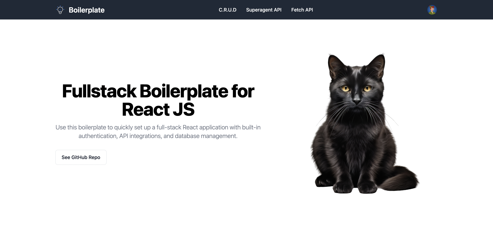
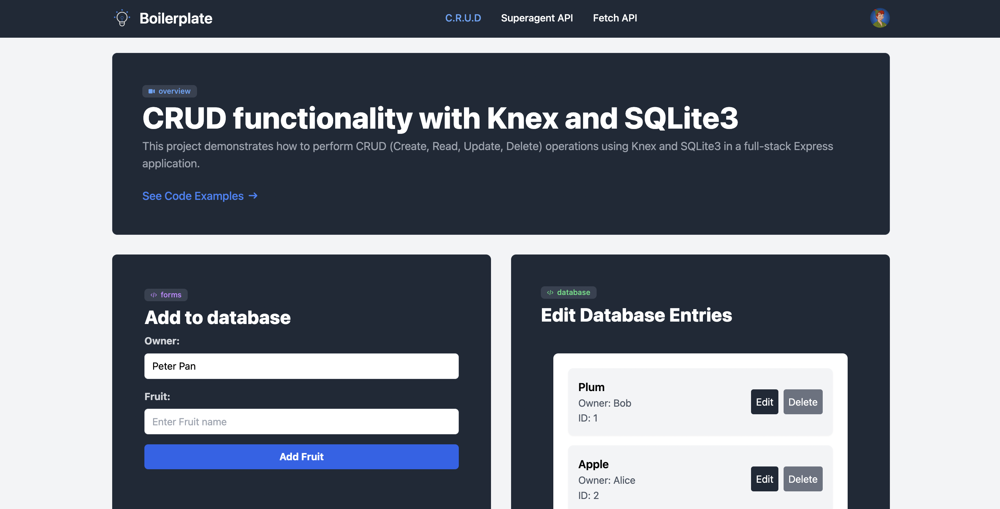
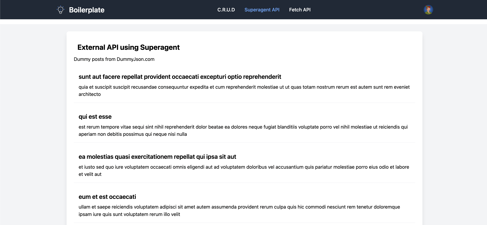

# React / Express Boilerplate: Fullstack 

This full-stack boilerplate for React applications demonstrates complete CRUD (Create, Read, Update, Delete) functionality with integrated authentication using Auth0. The backend is built with Express, using JWT for secure authentication and handling database operations with Knex and a SQLite3 database.

The frontend leverages React for building the user interface, with TypeScript for type safety. Styling is managed with Tailwind CSS, and the application integrates tanstack/react-query for efficient server state management and data fetching. External API data is retrieved using fetch and superagent.

